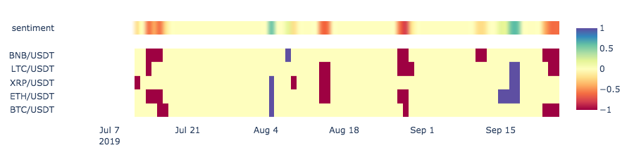

# cryptoz

#### Tracking the cryptocurrency market as a whole

The cryptocurrency market is a dynamic ecosystem. In times of an increased market volatility, altcoins may be moving in sync with Bitcoin, or they may suddenly boom. For example, computing platforms such as ETH and EOS are more likely to behave similarly. Correlations just appear and disappear with time, but do it slowly.

Instead of training complex RNNs and RL agents, which produce trades which are not transparent and are harder to justify, I found it better to rely upon multivariate charts. The one type which I really admire are time-based heatmaps. For example, you can easily compare Bollinger Bands of dozens of coins by a single look. Moreover, you can automatically cluster them to derive which coins are behaving similarly.

Binance is supported as a data source.

Workbook can be accessed through [Jupyter nbviewer](http://nbviewer.jupyter.org/github/polakowo/cryptoz/blob/master/Workbook.ipynb)

#### Installation
```
pip install git+https://github.com/polakowo/cryptoz.git
```


Example: Width of Bollinger Bands.
